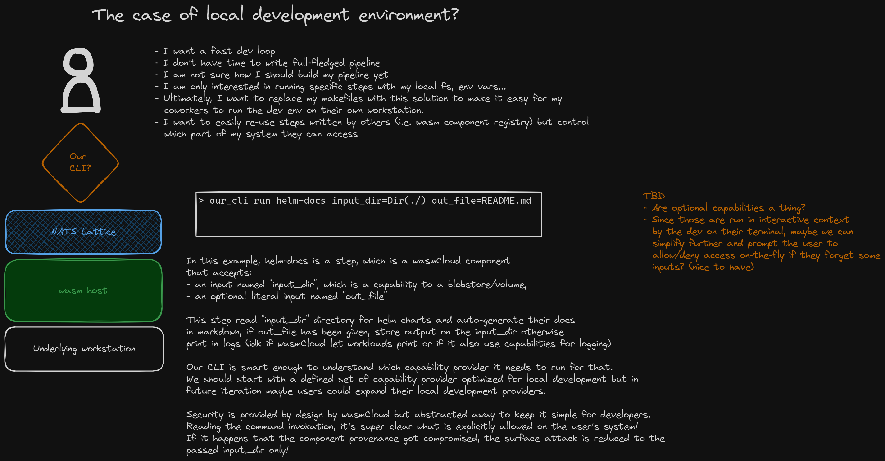
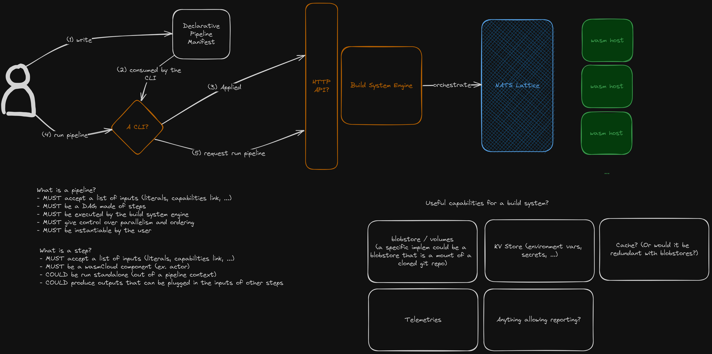

<h1><code>wdope</code></h1>

The best way to create dope DevOps Pipeline.

> :warning: **WIP**! Join the wasmCloud slack :pray:

---

## Introduction

`wdope` (*wasmCloud DevOps Pipeline Engine*) helps you to leverage the [wasmCloud ecosystem][wasm-cloud]
to build *DevOps Pipelines* (e.g. CI/CD pipelines) :rocket:

We use the term *DevOps Pipeline* as defined by [GitHub Resources][gh-dp]:

> A DevOps pipeline combines processes, tooling, and automation to enable organizations and software teams to
> build, test, and deliver high-quality software quickly to end users.

This obviously encompasses CI/CD but also include tooling used in *Software Supply Chains* as
defined by the [SLSA Spec v1.0][slsa-1.0]. This is important to note as `wdope` - but more generally, *wasmCloud* -
should bring the industry to a new level of security :smirk:

[wasm-cloud]: https://github.com/wasmCloud/wasmCloud
[gh-dp]: https://resources.github.com/devops/pipeline/
[slsa-1.0]: https://slsa.dev/spec/v1.0/terminology#software-supply-chain

## How it works?

### Local

### Remote

